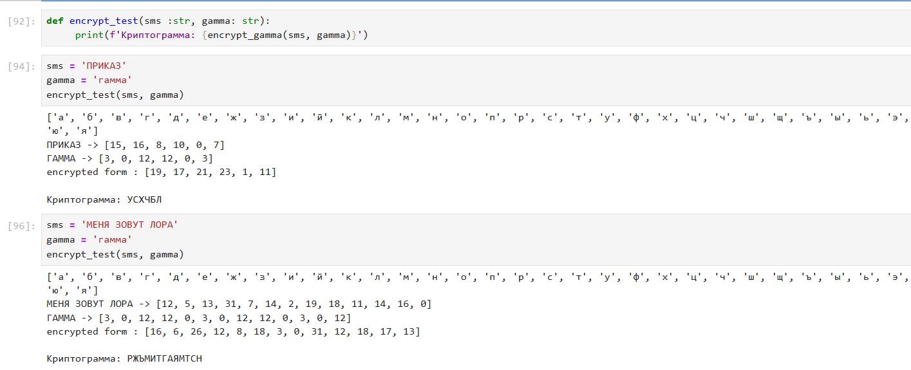

---
## Front matter
title : "Математические основы защиты информации и информационной безопасности"
title: "Отчёт по лабораторной работе 3"
subtitle: "Шифрование гаммированием "
author: "Еленга Невлора Люглеш"

## Generic otions
lang: ru-RU
toc-title: "Содержание"

## Bibliography
bibliography: bib/cite.bib
csl: pandoc/csl/gost-r-7-0-5-2008-numeric.csl

## Pdf output format
toc: true # Table of contents
toc-depth: 2
lof: true # List of figures
lot: true # List of tables
fontsize: 12pt
linestretch: 1.5
papersize: a4
documentclass: scrreprt
## I18n polyglossia
polyglossia-lang:
  name: russian
  options:
	- spelling=modern
	- babelshorthands=true
polyglossia-otherlangs:
  name: english
## I18n babel
babel-lang: russian
babel-otherlangs: english
## Fonts
mainfont: PT Serif
romanfont: PT Serif
sansfont: PT Sans
monofont: PT Mono
mainfontoptions: Ligatures=TeX
romanfontoptions: Ligatures=TeX
sansfontoptions: Ligatures=TeX,Scale=MatchLowercase
monofontoptions: Scale=MatchLowercase,Scale=0.9
## Biblatex
biblatex: true
biblio-style: "gost-numeric"
biblatexoptions:
  - parentracker=true
  - backend=biber
  - hyperref=auto
  - language=auto
  - autolang=other*
  - citestyle=gost-numeric
## Pandoc-crossref LaTeX customization
figureTitle: "Рис."
tableTitle: "Таблица"
listingTitle: "Листинг"
lofTitle: "Список иллюстраций"
lotTitle: "Список таблиц"
lolTitle: "Листинги"
## Misc options
indent: true
header-includes:
  - \usepackage{indentfirst}
  - \usepackage{float} # keep figures where there are in the text
  - \floatplacement{figure}{H} # keep figures where there are in the text
---


# Содержание

1. Цель работы
2. Задание
3. Теоретическое введение
4. Выполнение лабораторной работы
5. Выводы


# 1. Цель работы

изучить и реализовать шифрование гаммированием.

# 2. Задание

Реализовать алгоритм шифрования гаммированием конечной гаммой.

# 3. Теоретическое введение

Гаммирование – процедура наложения при помощи некоторой функции $F$ на
исходный текст гаммы шифра, т.е. псевдослучайной последовательности (ПСП) с
выходов генератора G. Псевдослучайная последовательность по своим
статистическим свойствам неотличима от случайной последовательности, но
является детерминированной, т.е. известен алгоритм ее формирования. Чаще
Обычно в качестве функции F берется операция поразрядного сложения по
модулю два или по модулю $N$ ($N$ – число букв алфавита открытого текста).

Простейший генератор псевдослучайной последовательности
представить рекуррентным соотношением:

$ Yi = a Yi-1+ b mod(m), i = 1, m,$
можно
где $у - 1$-й член последовательности псевдослучайных чисел, $а, Y, b$ - ключевые
параметры. Такая последовательность состоит из целых чисел от $0$ до т - $1$. Если
элементы $Vi$ и у совпадут, то совпадут и последующие участки: $1+11-/j+1,
Vi+2= 1j+2$. Таким образом, ПСП является периодической. Знание периода гаммы
Сарущественно облегчает криптоанализ. Максимальная длина периода равна т. Для ее достижения необходимо удовлетворить следующим условиям:

1. Вит - взаимно простые числа;
2. а - 1 делится на любой простой делитель числа т;
3. а - 1 кратно 4, если т кратно 4.

Стойкость шифров, основанных на процедуре гаммирования, зависит от
характеристик гаммы — длины и равномерности распределения вероятностей
появления знаков гаммы.
При использовании генератора ПСП получаем бесконечную гамму. Однако,
возможен режим шифрования конечной гаммы. В роли конечной гаммы может
выступать фраза. Как и ранее, используется алфавитный порядок букв, т.е. буква
«а» имеет порядковый номер 1, «б» - 2 и т.д.
Например, зашифруем слово «ПРИКАЗ» $(«16 17 09 11 01 08»)$ ше гаммой
«ГАММА» $(«04 01 13 13 01»)$. Будем использовать операцию побитового
сложения по модулю $33 (mod 33)$. Получаем:

$c₁ = 16+ 4(mod 33) = 20$

$c2 = 17 +1(mod 33) = 18$

$C3 = 9+13(mod 33) = 22$

$C4 = 11 + 13(mod 33) = 24$

$Cg = 1+1(mod 33) = 2$

$C6=8+4(mod 33) = 12.$

Криптограмма: «УСХЧБЛ» $(«20 18 22 24 02 12»).$


# 4. Выполнение лабораторной работы
### код
- функция получения алфавита: 

```Python
import numpy as np

def alphavit(choice):
    if choice == 'eng':
        return list(map(chr,range(ord('a'), ord('z')+1)))
    elif choice == 'rus':
        return list(map(chr,range(ord('а'), ord('я')+1)))
    else : 
        print('Выбирайте eng или rus')

```

- функция Шифрование гаммированием :


```Python
def encrypt_gamma(sms:str, gamma: str):
    alphav = alphavit('eng')
    if sms.lower() not in alphav :
        alphav = alphavit('rus')
    print(alphav)
    mes = len(alphav)
    def encrypt(letters: tuple):
        idx = (letters[0]+1)+(letters[1]+1)%mes
        if idx > mes:
           idx = idx - mes
        return idx-1
    sms_clear = list(filter (lambda s : s.lower() in alphav, sms))
    gamma_clear = list(filter (lambda s : s.lower() in alphav, gamma))
    
    sms_ind = list(map(lambda s : alphav.index(s.lower()), sms_clear))
    gamma_ind = list(map(lambda s : alphav.index(s.lower()), gamma_clear))
    for i in range(len(sms_ind)-len(gamma_ind)):
        gamma_ind.append(gamma_ind[i])
    print(f'{sms.upper()} -> {sms_ind}\n{gamma.upper()} -> {gamma_ind}')
    encrypted_ind = list(map(lambda s : encrypt(s), zip(sms_ind, gamma_ind)))
    print(f'encrypted form : {encrypted_ind}\n')
    return ''.join(list(map(lambda s: alphav[s], encrypted_ind))).upper()

```

- функция для тестирования :

```Python
def encrypt_test(sms :str, gamma: str):
     print(f'Криптограмма: {encrypt_gamma(sms, gamma)}')

```

- Результаты

{#fig:001 width=70%}


# 5. Выводы

    В ходе выполнения данной лабораторной работы изучили и реализовали  шифрование гаммированием.