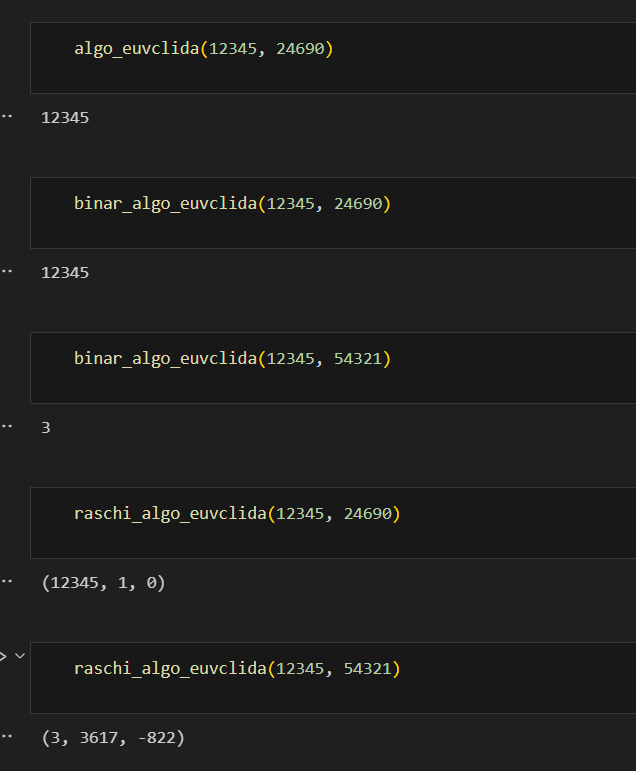
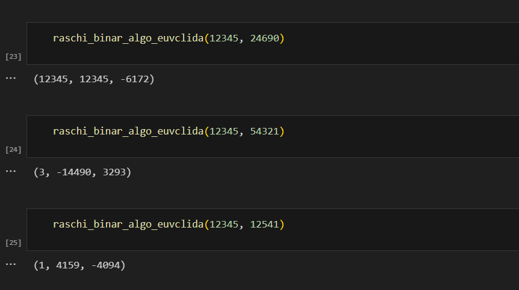

---
## Front matter
title: "Отчёт по лабораторной работе 4"
subtitle: "Шифрование гаммированием "
author: "Еленга Невлора Люглеш"

## Generic otions
lang: ru-RU
toc-title: "Содержание"

## Bibliography
bibliography: bib/cite.bib
csl: pandoc/csl/gost-r-7-0-5-2008-numeric.csl

## Pdf output format
toc: true # Table of contents
toc-depth: 2
lof: true # List of figures
lot: true # List of tables
fontsize: 12pt
linestretch: 1.5
papersize: a4
documentclass: scrreprt
## I18n polyglossia
polyglossia-lang:
  name: russian
  options:
	- spelling=modern
	- babelshorthands=true
polyglossia-otherlangs:
  name: english
## I18n babel
babel-lang: russian
babel-otherlangs: english
## Fonts
mainfont: PT Serif
romanfont: PT Serif
sansfont: PT Sans
monofont: PT Mono
mainfontoptions: Ligatures=TeX
romanfontoptions: Ligatures=TeX
sansfontoptions: Ligatures=TeX,Scale=MatchLowercase
monofontoptions: Scale=MatchLowercase,Scale=0.9
## Biblatex
biblatex: true
biblio-style: "gost-numeric"
biblatexoptions:
  - parentracker=true
  - backend=biber
  - hyperref=auto
  - language=auto
  - autolang=other*
  - citestyle=gost-numeric
## Pandoc-crossref LaTeX customization
figureTitle: "Рис."
tableTitle: "Таблица"
listingTitle: "Листинг"
lofTitle: "Список иллюстраций"
lotTitle: "Список таблиц"
lolTitle: "Листинги"
## Misc options
indent: true
header-includes:
  - \usepackage{indentfirst}
  - \usepackage{float} # keep figures where there are in the text
  - \floatplacement{figure}{H} # keep figures where there are in the text
---


# Содержание

1. Цель работы
2. Задание
3. Теоретическое введение
4. Выполнение лабораторной работы
5. Выводы


# 1. Цель работы

Изучить Вычисление наибольшего общего делителя и реализовать все рассмотренные алгоритмы программно.
- *Алгоритм Евклида*
- *Бинарный алгоритм Евклида*
- *Расширенный алгоритм Евклида*
- *Расширенный бинарный алгоритм Евклида*

# 2. Задание

Реализовать все рассмотренные алгоритмы программно.

# 3. Теоретическое введение

Пусть числа $а и в$ целые и в ≠ 0. Разделить а на в с остатком - значит представить а в виде $а = qb + r, где q, re Zn O < r < [b]$. Число q называется неполным частным, число r - неполным остатком от деления а на в.
Целое число d # 0 называется наибольшим общим делителем целыхacкor чисел
$а, аг, ..., ак$ (обозначается $d = НОД (а1, аг, ..., ак))$, если выполняются следующие
условия:
1. каждое из чисел $а, а2, ..., а$ делится на d; Г. Черн
2. если d # 0 - другой общий делитель чисел $а1, аг, ..., ак,$
Например, $НОД (12345, 24690) = 12345, НОД(12345, 54321) = 3, Ненулевые целые числа а и в называются ассоциированными $(обозначается a~b)$, если а делится на в и в делится на а.

Для любых целых чисел $a1a2, ал, аг, ...,$ ак существует наибольший общий делитель а и его можно представить в виде линейной комбинации этих чисел:
$d = ca1 + 22 + + Скак, С E Z$ (Z - множество целых чисел).
Например, $НОД чисел 91, 105, 154$  равен $7$. В качестве линейного представления можно взять Вайгосуда a $7=7.91+ (-6) 105 +0· 154$
Целые числа $а1, аг, ..., ак$ называются взаимно простыми в совокупности, атов если $НОД(а, аг, ..., ак)=1$. Целые числа а и в называются взаимно простыми, если $НОД(a,b)=1.7=4.91+1 105-3154$
Целые числа $а1, а2, ..., ак$ называются попарно взаимно простыми, если $НОД (а, а)=1$ для всех  1 < i # j ≤ k.


# 4. Выполнение лабораторной работы
### код
- функция для Алгоритма Евклида: 

```Python
def algo_euvclida(a,b):
    r0, r1 =a, b
    i = 1
    while True :
        ri_plus_1 = r0 % r1
        if ri_plus_1 == 0:
         return r1
        r0, r1 = r1, ri_plus_1
        i = i+1

```

- функция для Бинарного алгоритма Евклида :


```Python
def binar_algo_euvclida(a,b):
    g=1
    while a%2 == 0 and b%2 == 0:
        a = a // 2
        b = b // 2
        g *= 2
    u, v = a, b

    while u != 0:
        while u % 2 == 0:
            u = u // 2
        while v % 2 == 0:
            v = v // 2
        if u >= v:
            u = u - v
        else :
            v = v-u
    d =g*v
    return d    

```

- функция для расширенного алгоритма Евклида :

```Python
def raschi_algo_euvclida(a,b):
    r0, r1 = a, b
    x0, x1 = 1, 0
    y0, y1 = 0, 1
    i = 1
    while True: 
        qi = r0 // r1
        ri_plus_1 = r0 % r1
        if ri_plus_1 == 0:
            d = r1
            x = x1
            y = y1
            return d, x, y
        xi_plus_1 = x0 - qi * x1
        yi_plus_1 = y0 - qi * y1

        r0, r1 = r1, ri_plus_1
        x0, x1 = x1, xi_plus_1
        y0, y1 = y1, yi_plus_1
        i += 1

```

- функция для расширенного бинарного алгоритма Евклида :

```Python
   def raschi_binar_algo_euvclida(a,b):
    original_a , original_b = a, b
    g=1
    while a%2 == 0 and b%2 == 0:
        a = a // 2
        b = b // 2
        g *= 2
    u, v = a, b
    A, B, C, D = 1, 0, 0, 1

    while u != 0:
        while u % 2 == 0:
            u = u // 2
            if A % 2 == 0 and B % 2 == 0:
                A = A // 2
                B = B // 2
            else :
                 A = (A + original_b) // 2
                 B = (B - original_a) // 2
        while v % 2 == 0:
            v = v // 2
            if C % 2 == 0 and D % 2 == 0:
                C = C // 2
                D = D // 2
            else:
                C = (C + original_b) // 2
                D = (D - original_a) // 2
        if u >= v:
            u = u - v
            A = A - C
            B = B - D
        else :
            v = v-u
            C = C - A
            D = D - B
    d =g*v
    x, y = C, D
    return d , x, y
```

- Результаты

{#fig:001 width=70%}
{#fig:001 width=70%}


# 5. Выводы

  В ходе выполнения данной лабораторной работы изучили и реализовали :
- *Алгоритм Евклида*
- *Бинарный алгоритм Евклида*
- *Расширенный алгоритм Евклида*
- *Расширенный бинарный алгоритм Евклида*.