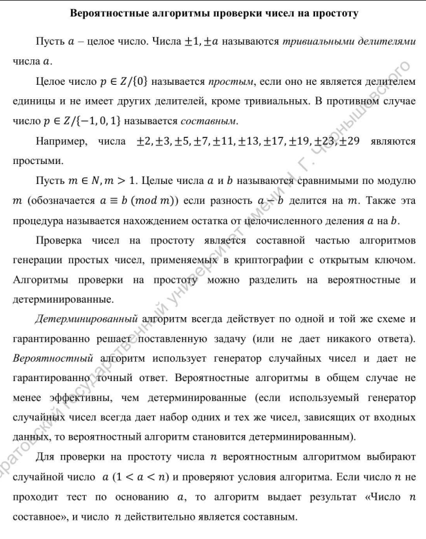
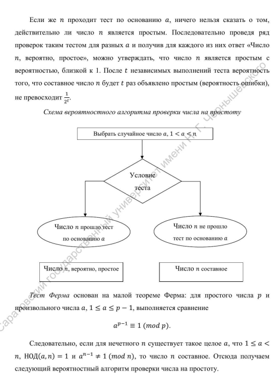
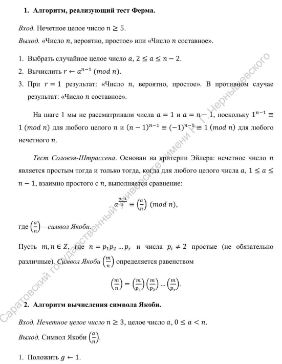
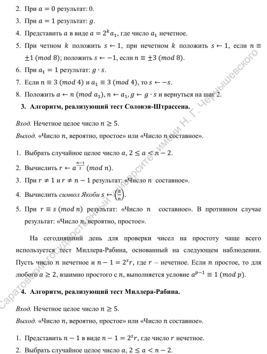
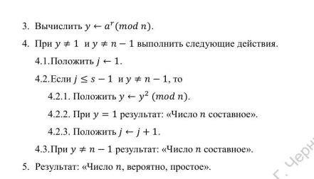

---
## Front matter
title : "Математические основы защиты информации и информационной безопасности"
title: "Отчёт по лабораторной работе 5"
subtitle: "Шифрование гаммированием "
author: "Еленга Невлора Люглеш"

## Generic otions
lang: ru-RU
toc-title: "Содержание"

## Bibliography
bibliography: bib/cite.bib
csl: pandoc/csl/gost-r-7-0-5-2008-numeric.csl

## Pdf output format
toc: true # Table of contents
toc-depth: 2
lof: true # List of figures
lot: true # List of tables
fontsize: 12pt
linestretch: 1.5
papersize: a4
documentclass: scrreprt
## I18n polyglossia
polyglossia-lang:
  name: russian
  options:
	- spelling=modern
	- babelshorthands=true
polyglossia-otherlangs:
  name: english
## I18n babel
babel-lang: russian
babel-otherlangs: english
## Fonts
mainfont: PT Serif
romanfont: PT Serif
sansfont: PT Sans
monofont: PT Mono
mainfontoptions: Ligatures=TeX
romanfontoptions: Ligatures=TeX
sansfontoptions: Ligatures=TeX,Scale=MatchLowercase
monofontoptions: Scale=MatchLowercase,Scale=0.9
## Biblatex
biblatex: true
biblio-style: "gost-numeric"
biblatexoptions:
  - parentracker=true
  - backend=biber
  - hyperref=auto
  - language=auto
  - autolang=other*
  - citestyle=gost-numeric
## Pandoc-crossref LaTeX customization
figureTitle: "Рис."
tableTitle: "Таблица"
listingTitle: "Листинг"
lofTitle: "Список иллюстраций"
lotTitle: "Список таблиц"
lolTitle: "Листинги"
## Misc options
indent: true
header-includes:
  - \usepackage{indentfirst}
  - \usepackage{float} # keep figures where there are in the text
  - \floatplacement{figure}{H} # keep figures where there are in the text
---


# Содержание

1. Цель работы
2. Задание
3. Теоретическое введение
4. Выполнение лабораторной работы
5. Выводы


# 1. Цель работы

Изучить и Реализовать Вероятностные алгоритмы проверки чисел на простоту.

# 2. Задание

Реализовать все рассмотренные алгоритмы программно.

- 1. Алгоритм, реализующий тест Ферма
- 2. Алгоритм вычисления символа Якоби
- 3. Алгоритм, реализующий тест Соловэя-Штрассена
- 4. Алгоритм, реализующий тест Миллера-Рабина.

# 3. Теоретическое введение


{#fig:001 width=70%}


{#fig:001 width=70%}


{#fig:001 width=70%}


{#fig:001 width=70%}


{#fig:001 width=70%}


# 4. Выполнение лабораторной работы
### код
- функция получения алфавита: 

```Python


```

- функция Шифрование гаммированием :


```Python


```

- функция для тестирования :

```Python


```

- Результаты

{#fig:001 width=70%}


# 5. Выводы

    В ходе выполнения данной лабораторной работы изучили и реализовали  Вероятностные алгоритмы проверки чисел на простоту.